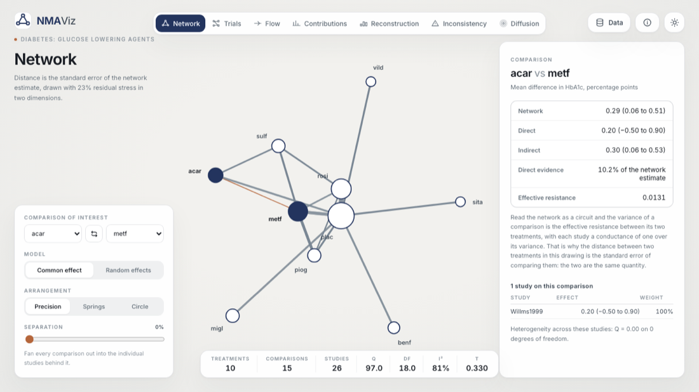
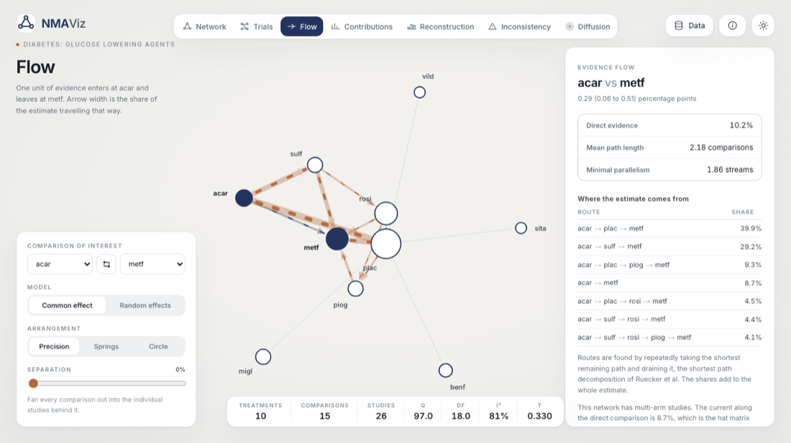
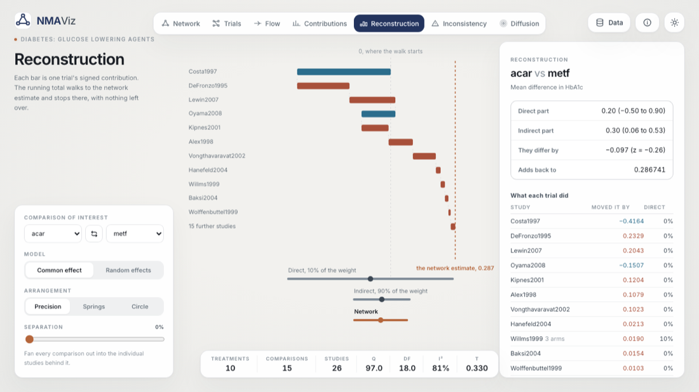
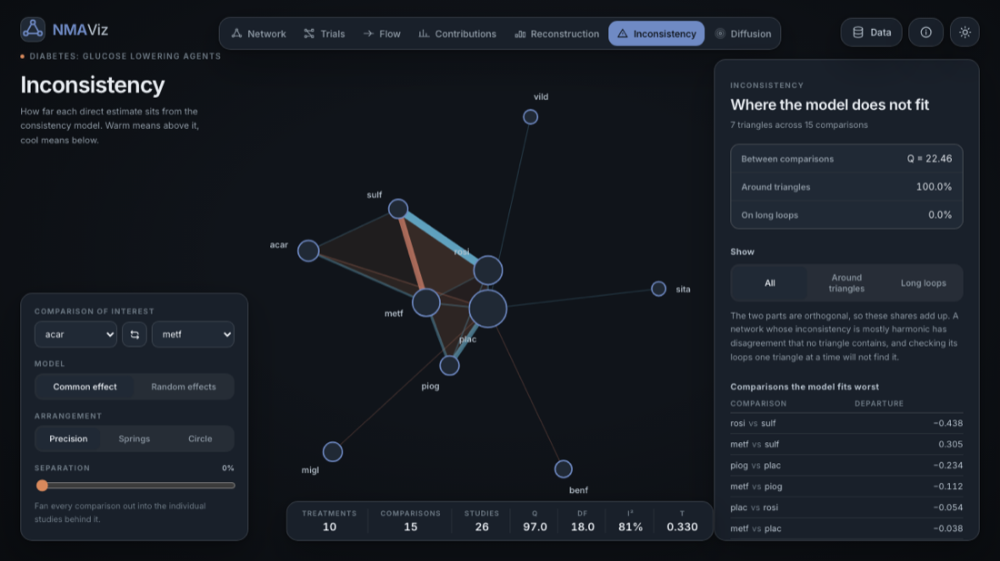
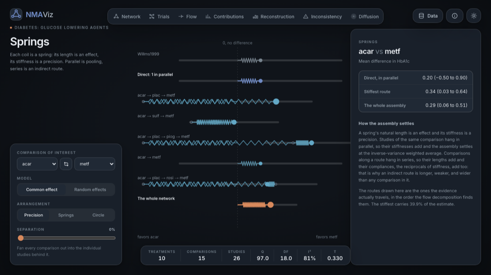

# NMAViz

**Read the evidence structure of a network meta-analysis, through the lenses the methods literature
has proposed for it.**

Upload the data behind an NMA and the site fits the frequentist graph-theoretical model in your
browser, then draws that one fitted model eight different ways: as a map whose distances are
standard errors, as trials rather than comparisons, as a flow of evidence, as a contribution
matrix, as a signed reconstruction of the estimate trial by trial, as a decomposition of its
inconsistency, as a diffusion, and as a system of springs.

There is no backend and no upload. The file is parsed, analyzed and drawn on your own machine.

**[Open it at nmaviz.xera.ac](https://nmaviz.xera.ac)**



|  |  |
| --- | --- |
|  |  |
| Where one estimate comes from | What each trial did to it |
|  |  |
| Inconsistency triangles can see, and cannot | Studies in parallel, routes in series |

## What it does

Most network meta-analysis software answers what the estimates are. This answers where they came
from. Every view below is the same fitted model seen from a different angle, and the comparison of
interest is a single control shared across all of them, so switching lens changes the question, not
the subject.

| Lens | What it shows | After |
| --- | --- | --- |
| **Network** | Every comparison, with the studies behind it, in an arrangement where the distance between two treatments is the standard error of comparing them. A separation control fans each comparison out into its individual studies. | Rücker 2012 |
| **Trials** | Trials as nodes of their own, so a multi-arm trial is one object touching three treatments rather than three indistinguishable edges. The designs table is the incomplete block reading. | Davies 2026, Senn 2013 |
| **Flow** | Where one estimate actually comes from: each comparison oriented the way its current runs, with the routes and their shares. | König, Krahn and Binder 2013 |
| **Contributions** | Which comparisons, and which trials, the estimate rests on, under both the shortest path and the random walk method at once. | Davies et al 2022, Rücker et al 2024 |
| **Reconstruction** | What each trial did: a signed amount, in the units of the outcome, and a waterfall that walks to the network estimate with nothing left over. | Wang et al 2026 |
| **Inconsistency** | The disagreement triangles can see, and the disagreement they cannot, as an orthogonal split of the between-comparison Q. | Jiang et al 2011 |
| **Diffusion** | How far the evidence had to travel to explain the uncertainty, animated as a convergent series rather than as decoration. | Rücker, Davies and Schwarzer 2026 |
| **Springs** | The mechanism: studies in parallel, routes in series, on the effect axis. | Papakonstantinou et al 2021 |

## Data it accepts

A CSV or tab separated file, in either of the two shapes people have.

**Contrast level**, one row per comparison:

```
study,treat1,treat2,TE,seTE
Trial A,drug,placebo,-0.42,0.19
```

**Arm level**, one row per arm, either binary or continuous:

```
study,treatment,event,n            study,treatment,mean,sd,n
```

Arm-level data is converted with the same formulas `netmeta::pairwise` uses, including the
continuity correction for a study with a zero cell. Common column names are recognized
automatically (`t1`, `lnOR`, `selnOR`, `trial`, `author`, and so on), and the data panel shows the
mapping it settled on.

A contrast-level file carries numbers but not the scale they are on, so the effect measure is
guessed from the name of the effect column and defaults to the identity scale, where the numbers
are shown exactly as the file gave them. The data panel names the guess and lets you correct it;
correcting it matters, because a ratio measure is fitted on the log scale and shown exponentiated.

Pooled results alone are not enough, and the site says so rather than guessing: every lens here
reads the hat matrix, and the hat matrix is built from the individual studies.

Thirteen example networks ship with the site, the full set distributed with the R package
`netmeta`: three treatments to twenty-two, three studies to ninety-three, two-arm only to heavily
multi-arm, and mean differences through odds and incidence rate ratios.

## Is the arithmetic right

The engine is a from-scratch JavaScript implementation of the graph-theoretical model, so the
question matters. `scripts/fixtures.R` writes what netmeta 3.6.1 computes for six published
networks, two of them with multi-arm studies, and the test suite compares this engine to those
numbers rather than to itself:

- the Laplacian and its Moore-Penrose pseudoinverse
- the hat matrix, in netmeta's own row order
- the common and random effect estimates and standard errors, for every pair
- the direct and indirect estimates and the direct evidence proportion
- Q, its degrees of freedom, τ² and I²
- the internal sort order and the multi-arm variance adjustment, row by row
- the evidence flow measures, and the contribution matrices under both methods

Everything above agrees to at least seven decimal places, and most of it to nine, except the
shortest path contribution method, which is held to a looser tolerance on purpose: when several routes of equal length are
available it drains whichever the implementation finds first, and that ambiguity is exactly what
the random walk method was introduced to remove.

Beyond the comparison with netmeta, the structural claims are tested as claims. Kirchhoff's law
holds at every treatment in every flow network. The diffusion series converges to the effective
resistances the Laplacian gives. The Hodge parts rebuild the observed flow, are orthogonal in the
precision-weighted inner product, and their energies add to the between-comparison part of Q
computed the other way round. The signed trial contributions add to the network estimate, and their
treatment balances add to the target contrast.

```sh
npm test
```

## Run

Node.js 22.13 or newer.

```sh
npm ci
npm run dev      # http://127.0.0.1:3021
npm run build
npm run preview
```

Regenerating the fixtures and the bundled examples needs R with `netmeta` and `jsonlite`:

```sh
Rscript scripts/fixtures.R
Rscript scripts/examples.R
```

## Choices worth knowing about

**Multi-arm studies.** The model uses netmeta's reduce-weights adjustment, and τ² enters the study
variances before that adjustment rather than after. Two consequences surface in the interface
rather than being hidden. The published direct evidence proportion, a ratio of variances computed
on the studies' original standard errors, separates from the hat matrix entry on the model's own
weights; both are shown. And the exact within-study covariance, which Wang et al use, would give a
slightly different fit from the one netmeta reports, so the reconstruction lens uses the model's own
weights for its coefficients, in order to add up to the estimate the rest of the site shows, and the
true covariance for its uncertainties, because the direct and indirect parts of a multi-arm trial
are genuinely correlated.

**The arrangement.** The Laplacian pseudoinverse is a Gram matrix, so its principal coordinates
place treatments where the straight-line distance between two of them is the standard error of the
network estimate comparing them. Two dimensions cannot generally hold that, so stress majorization
fits it as closely as a plane allows, overlapping circles are nudged apart, and the residual stress
is measured on the drawing that is actually on screen and printed under the title.

**Inconsistency.** The Hodge split is computed on one pooled estimate per comparison. Disagreement
between studies of the same comparison is heterogeneity, not inconsistency, and is not part of it.
It is a diagnostic to read alongside a design-by-treatment interaction model, not a replacement for
one.

**Mean path length and minimal parallelism** are computed over comparisons. netmeta groups a
multi-arm study's comparisons into a single design first, so the two definitions differ where a
multi-arm study is involved; the tests check them on the networks where they coincide.

## What this is not

It does not fit Bayesian models, rank treatments, produce SUCRA or rankograms, assess risk of bias,
or judge transitivity. It has no opinion on whether a network should have been analyzed at all.
Nothing here establishes transitivity, absence of bias, or a clinically meaningful ranking: zero
inconsistency is not evidence of validity, and a large contribution is not evidence of quality.

## Privacy

The site is static. There is no account, no login, and no server that records anything about a
visitor. An uploaded file is read by the browser and never leaves the machine; the theme choice is
kept in local storage.

## License

MIT. Inter is licensed under the SIL Open Font License. The example networks are redistributed from
the R package `netmeta`, which is GPL-2 licensed, with each network's original source cited in the
data panel.

## References

The lenses implement, in order:

- Rücker G. Network meta-analysis, electrical networks and graph theory. *Res Synth Methods*
  2012;3(4):312-324.
- Senn S, Gavini F, Magrez D, Scheen A. Issues in performing a network meta-analysis.
  *Stat Methods Med Res* 2013;22(2):169-189.
- König J, Krahn U, Binder H. Visualizing the flow of evidence in network meta-analysis and
  characterizing mixed treatment comparisons. *Stat Med* 2013;32(30):5414-5429.
- Jiang X, Lim LH, Yao Y, Ye Y. Statistical ranking and combinatorial Hodge theory.
  *Math Program* 2011;127(1):203-244.
- Papakonstantinou T, Nikolakopoulou A, Egger M, Salanti G. Meta-analysis as a system of springs.
  *Res Synth Methods* 2021;12(2):176-186.
- Davies AL, Papakonstantinou T, Nikolakopoulou A, Rücker G, Galla T. Network meta-analysis and
  random walks. *Stat Med* 2022;41(12):2091-2114.
- Rücker G, Papakonstantinou T, Nikolakopoulou A, Schwarzer G, Galla T, Davies AL. Shortest path or
  random walks? A framework for path weights in network meta-analysis. *Stat Med*
  2024;43(22):4287-4304.
- Davies AL. The bipartite structure of treatment-trial networks reveals the flow of information in
  network meta-analysis. *J R Stat Soc Ser A* 2026.
- Rücker G, Davies AL, Schwarzer G. Network meta-analysis and diffusion. *Res Synth Methods* 2026.
- Wang C, Zhang Y, Jin Z, O'Connor A. Contrast-space projection for network meta-analysis: an exact
  and invariant study-based decomposition of direct and indirect contributions. 2026.

The reference implementation this engine is tested against is Schwarzer G, Carpenter JR, Rücker G.
*netmeta: Network Meta-Analysis using Frequentist Methods*, R package version 3.6.1.

Multilevel network meta-regression, which the reading behind this project also covers, is a way to
adjust a network for differences between populations rather than a way to look at one. It is not
implemented here, and nothing on the site is population adjusted.
